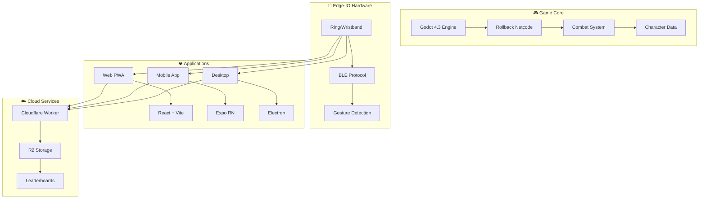

# 🥊 Anime Aggressors

> **Shōnen-style PvP arena brawler with optional Edge-IO wearables**

[](https://github.com/gunnchOS3k/anime-aggressors/actions)
[](LICENSE)
[](https://gunnchOS3k.github.io/anime-aggressors)

---

## 🎮 **What is Anime Aggressors?**

Anime Aggressors is a **next-generation fighting game** that combines the best of platform fighters (Smash Bros) with the intensity of anime brawlers (Dragon Ball Sparking). Built from the ground up with **rollback netcode** and **gesture-driven combat** using optional Edge-IO wearables.

### ✨ **Key Features**

* 🥊 **Shōnen Combat**: Fast-paced, aerial-heavy fighting with cancel routes and combo systems
* 🌐 **Cross-Platform**: Web, Mobile, Desktop with unified rollback netcode
* 🎯 **Gesture Control**: Optional Edge-IO rings/wristbands for motion-based inputs
* ⚡ **Sub-50ms Latency**: Rollback netcode designed for competitive play
* 🎨 **Anime Aesthetics**: Stylized toon-shaded graphics with readable VFX
* 🔧 **Mod Support**: Data-driven character system with JSON move definitions

---

## 🚀 **Quick Start**

### **Web Demo** (Try it now!)

```bash
# Clone and run locally
git clone https://github.com/gunnchOS3k/anime-aggressors.git
cd anime-aggressors/apps/web
npm install && npm run dev
# Open http://localhost:3000
```

### **Hardware Setup** (Optional)

```bash
# Flash Edge-IO firmware
cd firmware/ring
pio run -t upload

# Connect via BLE and test gestures
cd apps/web
npm run dev
```

---

## 🏗️ **Architecture**



---

## 📁 **Project Structure**

```
anime-aggressors/
├── 🎮 game/                 # Godot 4.3 project (rollback-first)
├── 📱 apps/
│   ├── web/               # React PWA with gesture demo
│   ├── mobile/            # Expo React Native
│   └── desktop/           # Electron bridge
├── 🔧 packages/
│   ├── edgeio/            # Gesture detection library
│   └── messages/          # Shared TypeScript schemas
├── 🔌 hardware/
│   ├── ring/              # KiCad schematics + BOM
│   └── wristband/         # Edge-IO hardware designs
├── ⚡ firmware/
│   ├── ring/              # nRF52840 Arduino code
│   └── wristband/         # BLE + IMU + haptics
└── ☁️ cloud/
    └── worker/            # Cloudflare Worker + R2
```

---

## 🎯 **Game Design**

### **Core Mechanics**

* **Resources**: HP, Ki (specials), Stamina (guards/dashes)
* **Movement**: Air dashes, vanishes, wall jumps
* **Combat**: Light/Heavy/Special with cancel routes
* **Supers**: Cinematic ultimates with quick cutbacks

### **Input Systems**

* **Standard**: Keyboard, Gamepad, Touch
* **Edge-IO**: Swipe gestures → Dodge, Thrust → Heavy, Tap → Special
* **Accessibility**: Full remapping and alternative controls

---

## 🔬 **Edge-IO Technology**

### **Hardware Specs**

* **MCU**: nRF52840 (BLE 5.0)
* **Sensors**: 6-axis IMU (BMI270)
* **Haptics**: DRV2605L + ERM/LRA
* **Power**: Li-Po 50-300mAh
* **Connectivity**: BLE with <50ms latency

### **Gesture Library**

```typescript
import { EdgeIO } from '@anime-aggressors/edgeio';

const edgeio = new EdgeIO();
await edgeio.connect();

edgeio.onGesture((gesture) => {
  if (gesture.type === 'swipeR') {
    player.dodge('right');
  }
});
```

---

## 🌐 **Deployment**

### **Web Build**

```bash
cd apps/web
npm run build
# Deploy dist/ to Vercel, Netlify, or GitHub Pages
```

### **Mobile Build**

```bash
cd apps/mobile
npx expo build:android
npx expo build:ios
```

### **Desktop Build**

```bash
cd apps/desktop
npm run build:win
npm run build:mac
npm run build:linux
```

---

## 🤝 **Contributing**

We welcome contributions! See our [Contributing Guide](CONTRIBUTING.md) for details.

### **Development Setup**

```bash
# Install dependencies
npm install

# Run all packages
npm run dev

# Test Edge-IO library
cd packages/edgeio
npm test

# Build web app
cd apps/web
npm run build
```

---

## 📊 **Roadmap**

* **Q1 2025**: Core game mechanics + 2 characters
* **Q2 2025**: Edge-IO hardware integration
* **Q3 2025**: Mobile app + cloud services
* **Q4 2025**: Full release + tournament mode

---

## 📄 **License**

MIT License - see [LICENSE](LICENSE) for details.

---

## 🔗 **Related Projects**

* **Edge-IO** \- Gesture detection hardware
* **ReadyGary** \- 6G beam selection research

---

**Built with ❤️ by the Anime Aggressors team**

🌐 [Web Demo](https://gunnchOS3k.github.io/anime-aggressors) • 📱 [Mobile](https://github.com/gunnchOS3k/anime-aggressors) • 💬 [Discord](https://discord.gg/anime-aggressors)