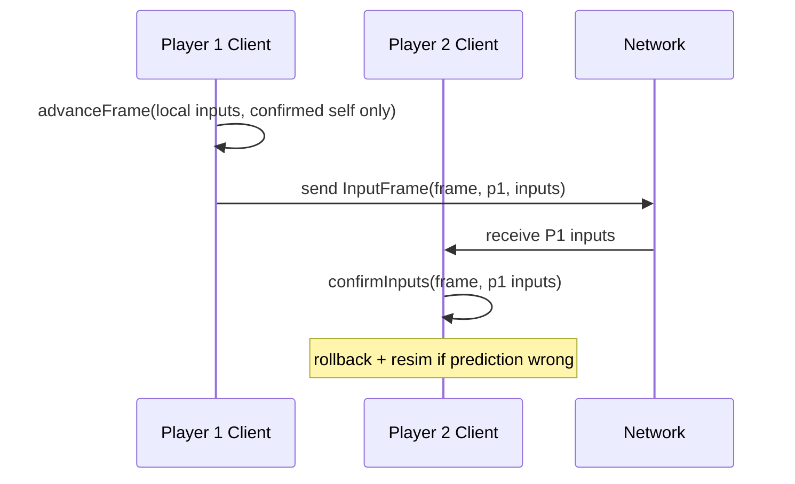

# Rollback Design

**Package:** `packages/rollback`  
**Depends on:** `packages/game-core`  
**Last updated:** 2026-06-24

---

## Why rollback exists for couch/local play

Platform fighters demand frame-perfect inputs. Rollback netcode is the standard approach for hiding network latency online—but **Anime Aggressors uses the same rollback session locally** so that:

1. **One code path:** Couch, online, replay, and tournament modes all call `RollbackSession.advanceFrame` → `simulateFrame`.
2. **Replays are authoritative:** Input logs replayed through `replay()` must match live session hashes (`verifyAgainstReplay`).
3. **Debug matches production:** Debug overlay rollback count reflects real prediction recovery, not a separate debug sim.
4. **Online is additive:** Transport layer sends confirmed inputs; no second physics engine when networking ships.

Local couch today confirms all inputs immediately (`confirmed: [true, true]`), so rollback count stays 0 unless we inject artificial delay (planned v0.5) to stress-test prediction.

---

## Core concepts

### Deterministic simulation

`packages/game-core` implements a **fixed 60 Hz** tick:

- Same `GameState` + same `InputFrame[]` → same next state (verified by unit tests).
- Physics uses integer-friendly fixed-point (`FP_SCALE = 256`) for positions and velocities.
- Rendering never writes back into `GameState`.

```typescript
export function simulateFrame(state: GameState, inputs: InputFrame[]): GameState
```

### Input frames

One `InputFrame` per player per simulation frame:

```typescript
export type InputFrame = {
  frame: number;
  playerId: number;
  left: boolean;
  right: boolean;
  up: boolean;
  down: boolean;
  jump: boolean;
  attack: boolean;
  special: boolean;
  shield: boolean;
  dodge: boolean;
  grab: boolean;
  wearableGesture?: GestureName;
};
```

**Rule:** Raw keyboard, gamepad, and BLE events are converted to `InputFrame` in `apps/web/src/input/*` before entering rollback.

### State snapshots

After each simulated frame, `RollbackSession` stores:

```typescript
type FrameRecord = {
  frame: number;
  inputs: InputFrame[];
  confirmed: boolean[];
  state: GameState;      // deep clone
  hash: string;          // hashState(state)
};
```

Ring buffer size: `maxRollbackFrames + 1` (default 121 frames ≈ 2 s).

### Prediction

When advancing frame `f`, for each player `p`:

1. If input provided **and** confirmed → store in `confirmedInputs`, use it.
2. Else if already confirmed in history → use confirmed.
3. Else if provided but unconfirmed → store in `predictedInputs`, use as prediction.
4. Else if prior prediction exists → reuse prediction.
5. Else → **default empty input** (all buttons false).

Default input is conservative: no accidental movement on missing packets.

### Rollback

When `confirmInputs(frame, inputs)` arrives and a **predicted** input differs from **confirmed**:

1. Find snapshot at `frame` in history.
2. Restore `state` from that snapshot.
3. Set `currentFrame = frame`.
4. Increment `rollbackCount`; emit `rollback` event.
5. Truncate history after rollback point.

### Resimulation

From restored state, re-advance frame-by-frame until caught up:

```text
while currentFrame < targetFrame:
  resolve inputs (confirmed > predicted > default)
  state = simulateFrame(state, frameInputs)
  snapshot(currentFrame, ...)
  currentFrame++
```

Final state must match what would have occurred had inputs been known upfront.

### State hashing

`hashState(state)`:

1. `serializeState(state)` → JSON string (v0.1).
2. FNV-1a 32-bit hash over UTF-8 bytes.
3. Hex string, zero-padded to 8 chars.

Used for:

- Snapshot integrity in history
- `verifyAgainstReplay` desync detection
- Debug overlay display

**Future:** Binary serialization for cross-platform lockstep parity.

### Replay tests

`packages/game-core/src/replay.ts`:

```typescript
replay(initial: GameState, inputLog: InputFrame[][]): ReplayResult
```

Tests require:

| Test | Assertion |
|------|-----------|
| Same inputs, two step sims | Equal final hash |
| Step sim vs replay | Equal final hash |
| Serialize round-trip | Equal hash |

`packages/rollback/test/rollback.test.ts`:

- Wrong prediction at frame 10 → confirm correct input → `verifyAgainstReplay` passes.
- Wrong input log → `desyncDetected === true`.

### Desync detection

`verifyAgainstReplay(fromState, inputLog)`:

1. Runs authoritative `replay(fromState, inputLog)`.
2. Compares `result.finalHash` to `hashState(currentSessionState)`.
3. On mismatch: sets `desyncDetected`, records expected/actual hashes, emits `desync` event.

**Causes of desync:**

- Simulation code changed between record and playback
- Non-deterministic math (float drift across platforms)
- Input log corruption
- Different `GameConfig` or initial state

---

## RollbackSession API

```typescript
class RollbackSession {
  constructor(initialState: GameState, config: RollbackSessionConfig);

  advanceFrame(inputs: InputFrame[], confirmed: boolean[]): GameState;
  confirmInputs(frame: number, inputs: InputFrame[]): GameState;

  verifyAgainstReplay(fromState: GameState, inputLog: InputFrame[][]): boolean;

  getState(): GameState;
  getFrame(): number;
  getStats(): RollbackStats;
  getEvents(): RollbackEvent[];
  getRollbackCount(): number;
}
```

### RollbackStats

```typescript
type RollbackStats = {
  rollbackCount: number;
  lastRollbackFrame: number;
  desyncDetected: boolean;
  expectedHash: string | null;
  actualHash: string | null;
};
```

---

## Online mapping (future)



**Input delay:** Fixed frames of delay (e.g. 2) before inputs apply — standard rollback practice.

---

## Configuration

```typescript
type RollbackSessionConfig = {
  snapshotInterval: number;   // 1 = every frame
  maxRollbackFrames: number;  // default 120
  playerCount: number;        // 2 initial
};
```

Vertical slice (`App.ts`):

```typescript
new RollbackSession(gameState, {
  snapshotInterval: 1,
  maxRollbackFrames: 120,
  playerCount: 2,
});
```

---

## Performance considerations

| Concern | v0.1 approach | Limit |
|---------|---------------|-------|
| Snapshot memory | Full GameState clone per frame | ~120 frames × state size |
| Resim cost | O(rollback_depth × sim_cost) | Target < 5 ms for 120 frames on laptop |
| Hash cost | JSON stringify each snapshot | Acceptable for 2P; optimize if > 4P |

---

## Testing checklist

- [x] Determinism: identical hashes from parallel sims
- [x] Replay matches stepped sim
- [x] Rollback after wrong prediction restores hash
- [x] Desync flagged on wrong log
- [ ] Live couch with injected 100 ms delay shows rollbackCount > 0 (v0.5)
- [ ] Two-browser online hash match at frame 600 (v0.5)

---

## Related documents

- [ARCHITECTURE.md](./ARCHITECTURE.md)
- [INPUT_SYSTEM.md](./INPUT_SYSTEM.md)
- [PRODUCT_REQUIREMENTS.md](./PRODUCT_REQUIREMENTS.md) §16
- `packages/rollback/README.md`
