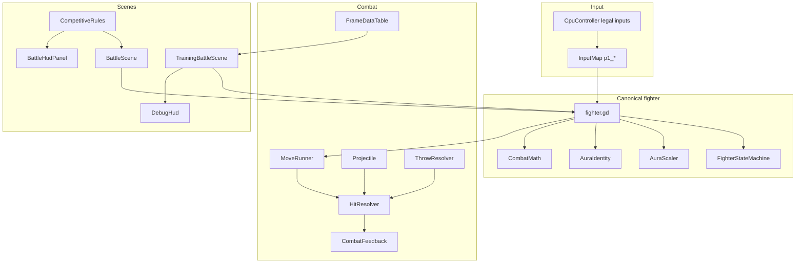

# Wave011 UML — aura combat deepenings (current)

```mermaid
flowchart TB
  subgraph input [Input]
    IM[InputMap p1_*]
    CPU[CpuController legal inputs]
  end
  subgraph fighter [Canonical fighter]
    F[fighter.gd]
    SM[FighterStateMachine]
    AI[AuraIdentity]
    AS[AuraScaler]
    CM[CombatMath]
  end
  subgraph combat [Combat]
    MR[MoveRunner]
    HR[HitResolver]
    PR[Projectile]
    TR[ThrowResolver]
    FB[CombatFeedback]
    FD[FrameDataTable]
  end
  subgraph scene [Scenes]
    BS[BattleScene]
    TRN[TrainingBattleScene]
    HUD[BattleHudPanel]
    DBG[DebugHud]
    CR[CompetitiveRules]
  end
  IM --> F
  CPU --> IM
  F --> SM
  F --> AS
  F --> AI
  F --> CM
  F --> MR
  MR --> HR
  PR --> HR
  TR --> HR
  HR --> FB
  CR --> BS
  CR --> HUD
  FD --> TRN
  BS --> F
  TRN --> F
  TRN --> DBG
```
