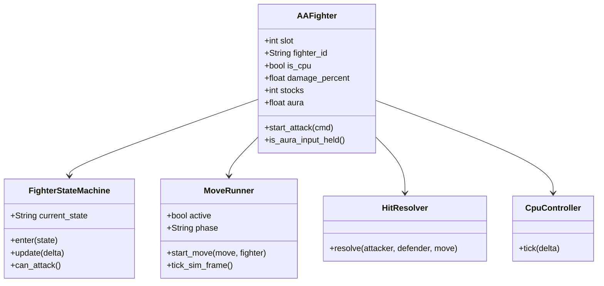

# Class — fighter / move (current)

Mapped to `scripts/fighters/fighter.gd` (`class_name AAFighter`), `fighter_state_machine.gd`, `scripts/combat/move_runner.gd`, `hit_resolver.gd`, `cpu_controller.gd`. Move JSON lives under `game-godot/data/moves/`.
