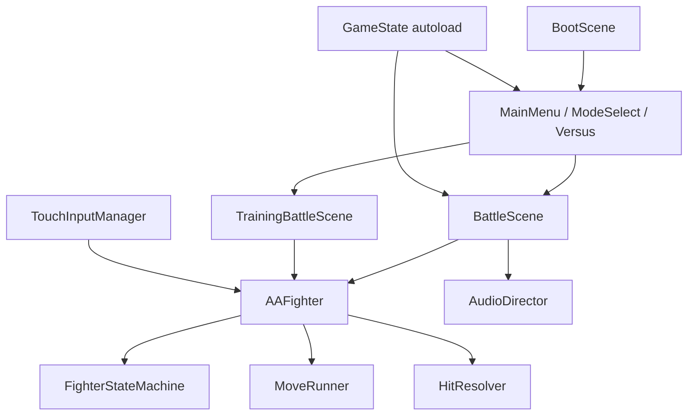

# Component — current

| Component | Path |
|---|---|
| Autoloads | `game-godot/project.godot` `[autoload]` |
| Scene router | `scripts/core/SceneRouter.gd` |
| Fighter | `scripts/fighters/fighter.gd` |
| Combat math | `scripts/combat/combat_math.gd` |
| Android export | `export_presets.cfg` preset Android, `scripts/export-godot-android.mjs` |
| Web shell (not combat) | `apps/web` |
