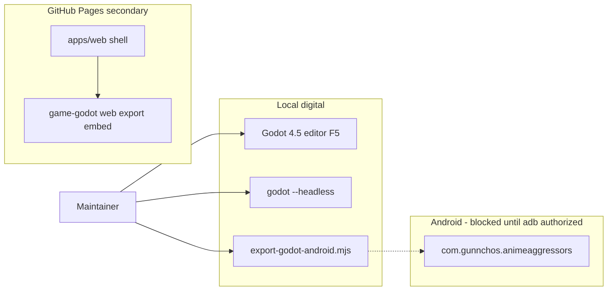

# Deployment — current

```mermaid
flowchart LR
  subgraph local [Local digital]
    GODOT[Godot 4.5 editor F5]
    CLI[godot --headless]
    APK[export-godot-android.mjs]
  end
  subgraph pages [GitHub Pages secondary]
    WEB[apps/web shell]
    EMBED[game-godot web export embed]
  end
  subgraph android [Android - blocked until adb authorized]
    PKG[com.gunnchos.animeaggressors]
  end
  DEV[Maintainer] --> GODOT
  DEV --> CLI
  DEV --> APK
  WEB --> EMBED
  APK -.-> PKG
```

Pixel 6a install is `HUMAN_QA_PENDING` — see `docs/PIXEL_6A_ACCEPTANCE.md`. Do not treat Pages Three.js `#/battle` as the deployed product.
