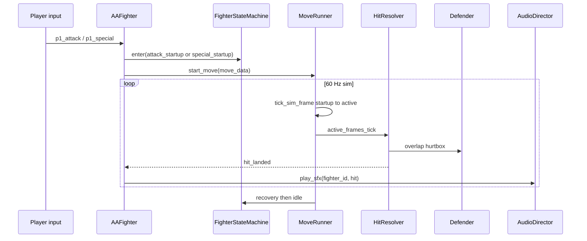

# Sequence — attack / special (current)

```mermaid
sequenceDiagram
  participant P as Player input
  participant F as AAFighter
  participant SM as FighterStateMachine
  participant MR as MoveRunner
  participant HR as HitResolver
  participant D as Defender
  participant AD as AudioDirector
  P->>F: p1_attack / p1_special
  F->>SM: enter(attack_startup or special_startup)
  F->>MR: start_move(move_data)
  loop 60 Hz sim
    MR->>MR: tick_sim_frame startup to active
    MR->>HR: active_frames_tick
    HR->>D: overlap hurtbox
    HR-->>F: hit_landed
    F->>AD: play_sfx(fighter_id, hit)
  end
  MR->>SM: recovery then idle
```

Code: `fighter.gd` attack/special start, `move_runner.gd` phases `startup`/`active`/`recovery`, `hit_resolver.gd`, `AudioDirector.play_sfx`.
