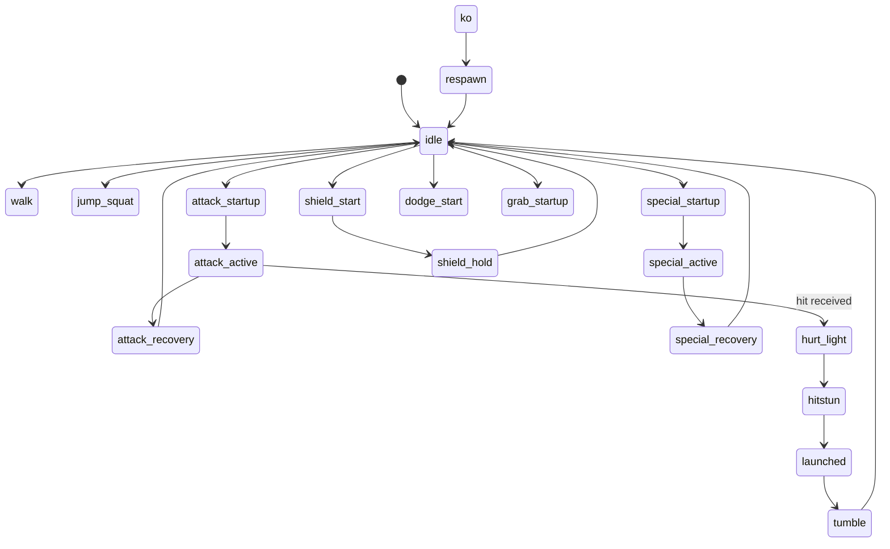

# State machine — combat (current)

Subset of `FighterStates` constants used in live battle.

Code: `scripts/fighters/fighter_states.gd`, transitions in `fighter_state_machine.gd` and `fighter.gd`.
