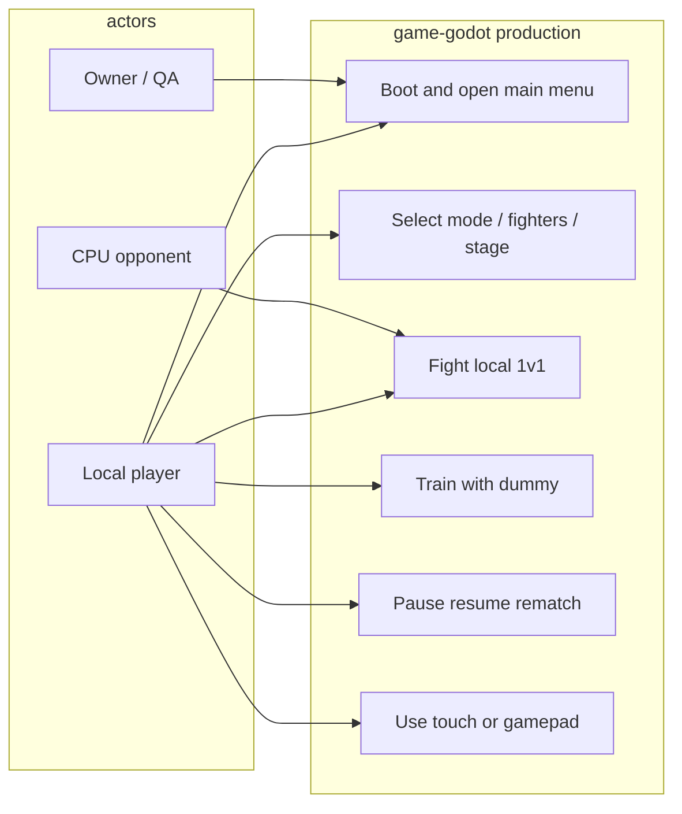

# Use case — current

Actors: local player, CPU opponent, Edmund (owner/QA). Wearable Edge-IO is out of the digital product path.

Code: `scripts/core/boot_scene.gd`, `scripts/menus/main_menu_scene.gd`, `scripts/battle/battle_scene.gd`, `scripts/training/training_menu_scene.gd`, `scripts/input/touch_controls_overlay.gd`.
