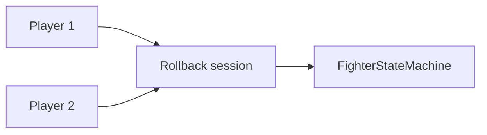

# Future — online rollback / store

Not implemented as a shipping matchmaker. Design references: `scripts/net/rollback_session_gd.gd`, `packages/rollback`.

Do not claim this path is live. Play Store AAB + release keystore remain owner-only.
