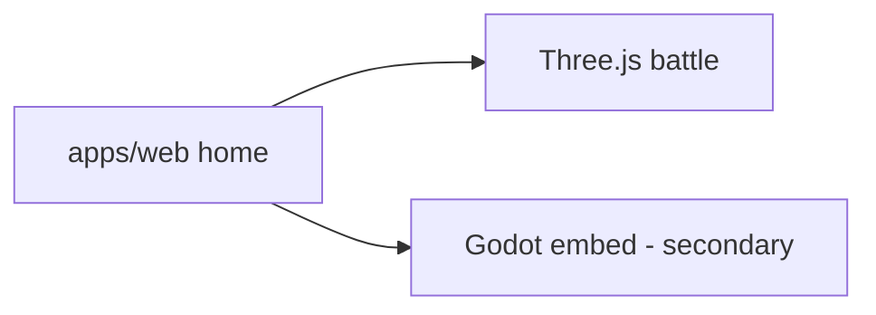

# Legacy — web runtime

`apps/web` + `packages/game-core` Three.js battle (`#/battle`, `#/play`) and deprecated `game/godot/`.

Policy: [docs/RUNTIME_SOURCE_OF_TRUTH.md](../../RUNTIME_SOURCE_OF_TRUTH.md), [docs/LEGACY_WEB_RUNTIME_STATUS.md](../../LEGACY_WEB_RUNTIME_STATUS.md).
